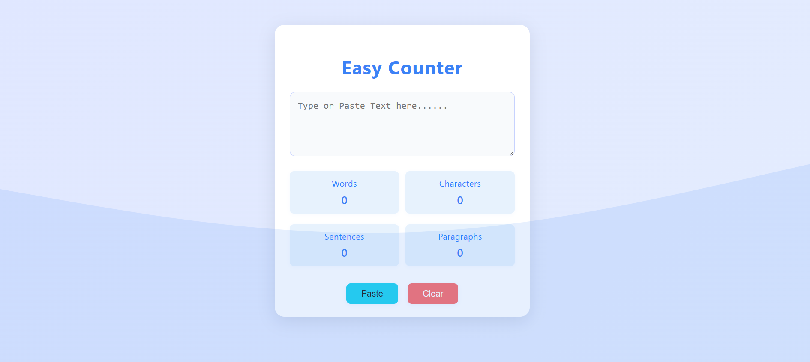

# Easy-Counter

Easy-Counter is a simple and modern web app to count words, characters, sentences, and paragraphs in your text.

## Features

- Live word, character, sentence, and paragraph counting
- Clear and Paste buttons for convenience
- Responsive and clean UI
- **Animated wavy background** for a modern look

## Screenshot

## How to Use

1. Clone or download this repository.
2. Open `index.html` in your browser.
3. Start typing or paste your text to see the counts update instantly.

## Technologies Used

- HTML5
- CSS3 (with animated SVG background)
- JavaScript

---

Made with ❤️ for productivity!